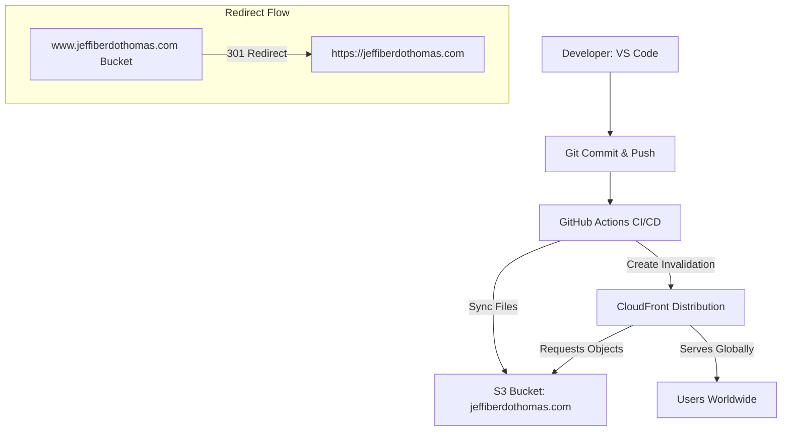

# 🚀 Automated Portfolio Deployment & Cloud Architecture  
[]()  
[]()  
[]()  
[]()  

This repository contains the source code and automated deployment pipeline for **jeffiberdothomas.com**, a globally distributed portfolio website hosted on **Amazon S3** and delivered securely through **Amazon CloudFront**.

Every push to `main` triggers a GitHub Actions workflow that deploys the latest version of the site automatically.

---

# 🧱 1. Project Overview

This project uses:

- **Amazon S3** → Private bucket for static hosting  
- **Amazon CloudFront** → CDN for global delivery  
- **GitHub Actions** → Automated CI/CD pipeline  
- **Route 53 + ACM** → DNS + HTTPS  
- **S3 Redirect Bucket** → Canonical redirect from `www` → root domain  

Deployment is fully automated:

1. Push to GitHub  
2. GitHub Actions syncs files to S3  
3. CloudFront cache is invalidated  
4. Users instantly see the latest version  

---

# 🏗️ 2. Architecture Diagram (Mermaid)



---

# 🔐 3. IAM User Setup

A dedicated IAM user (`github-s3-cloudfront-deployer`) was created with **least‑privilege** permissions:

### S3 Permissions
- `PutObject`
- `DeleteObject`
- `ListBucket`
- `GetObject`

### CloudFront Permissions
- `cloudfront:CreateInvalidation`

### GitHub Secrets
- `AWS_ACCESS_KEY_ID`
- `AWS_SECRET_ACCESS_KEY`
- `AWS_REGION`
- `S3_BUCKET`
- `CLOUDFRONT_DIST_ID`

---

# 📁 4. Repository Structure

```
/
├── index.html
├── style.css
├── images/
├── JavaScript/
│   ├── menu.js          → Mobile navigation toggle
│   ├── carousel.js      → Image/text carousel logic
│   ├── animations.js    → UI animations & transitions
│   └── profile.js       → Profile section interactions
└── favicon.ico
```

All JavaScript files are modular and organized inside the `JavaScript/` folder.

---

# ⚙️ 5. GitHub Actions Deployment Pipeline

Located at: `.github/workflows/deploy.yml`

### Workflow Summary

- Checkout repository  
- Configure AWS credentials  
- Sync files to S3  
- Invalidate CloudFront cache  

### Deployment Flow

1. Edit in VS Code  
2. Commit + push  
3. GitHub Actions deploys automatically  
4. CloudFront serves the updated site globally  

---

# 🧪 6. Local Testing with AWS CLI

Before automation, deployment was tested manually:

```bash
aws s3 sync . s3://myportfolio-website-jeffiberdothomas --delete
aws cloudfront create-invalidation --distribution-id E1H46KDGTDFK68 --paths "/*"
```

---

# 🌐 7. Canonical Redirect Configuration

To enforce a single canonical domain (`https://jeffiberdothomas.com`):

### S3 Buckets
- `jeffiberdothomas.com` → Primary hosting bucket (private)  
- `www.jeffiberdothomas.com` → Redirect bucket  

### Route 53
- A + AAAA records for both root and `www`  
- Both point to CloudFront  

### ACM Certificate
- Covers both domains  
- Attached to CloudFront  

### Verification
```
curl -I http://www.jeffiberdothomas.com
→ 301 Moved Permanently → https://jeffiberdothomas.com
```

---

# 🐛 8. Debugging Case Sensitivity Issue (Important Lesson)

During deployment, all JavaScript files returned **403 Forbidden**:

```
menu.js:1 Failed to load resource: 403
carousel.js:1 Failed to load resource: 403
animations.js:1 Failed to load resource: 403
```

### Root Cause

S3 is **case‑sensitive**.

Actual folder:

```
JavaScript/
```

HTML referenced:

```
javascript/
```

CloudFront requested files that **did not exist**, and S3 returned:

```
403 AccessDenied
```

instead of 404.

### Fix

Updated HTML paths:

```html
<script src="JavaScript/menu.js"></script>
<script src="JavaScript/carousel.js"></script>
<script src="JavaScript/animations.js"></script>
```

### Key Takeaways

- S3 object keys are case‑sensitive  
- CloudFront returns 403 for missing objects  
- Always verify folder names and paths  
- Debugging cloud deployments requires checking both infrastructure and code  

---

# 🧰 9. Tech Stack

### **Frontend**
- HTML5  
- CSS3  
- Vanilla JavaScript  
- Modular JS architecture (menu, carousel, animations, profile)

### **Cloud Infrastructure**
- Amazon S3 (private hosting)  
- Amazon CloudFront (CDN)  
- Route 53 (DNS)  
- ACM (SSL certificates)  
- IAM (least‑privilege deployment user)

### **CI/CD**
- GitHub Actions  
- AWS CLI  
- Automated invalidation + sync pipeline  

---

# 🚀 10. Future Enhancements

- Add dark mode toggle  
- Add lazy‑loading for images  
- Add contact form using AWS Lambda + SES  
- Add Lighthouse performance optimization  
- Add structured metadata for SEO  
- Add animated page transitions  
- Add blog section powered by Markdown  

---

# 🏁 11. Summary of Achievements

- Fully automated CI/CD pipeline  
- Secure private S3 hosting  
- Global delivery via CloudFront  
- Canonical redirect implementation  
- Modular JavaScript architecture  
- Real‑world debugging experience  
- Professional cloud‑ready portfolio  

---
